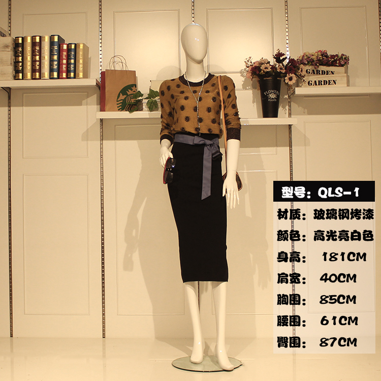
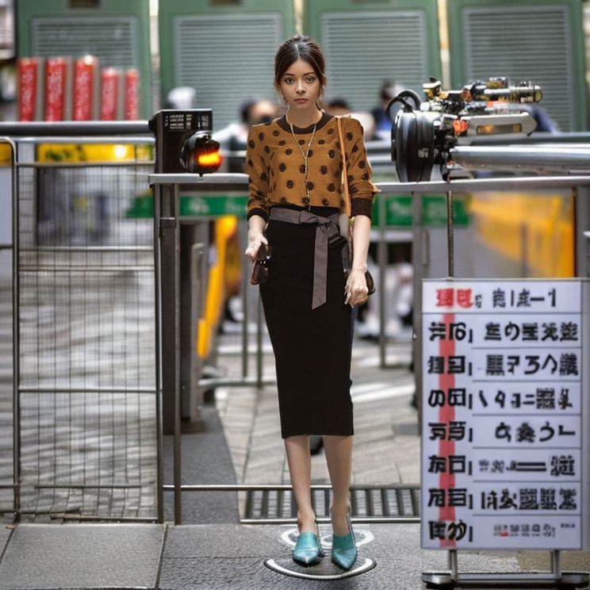
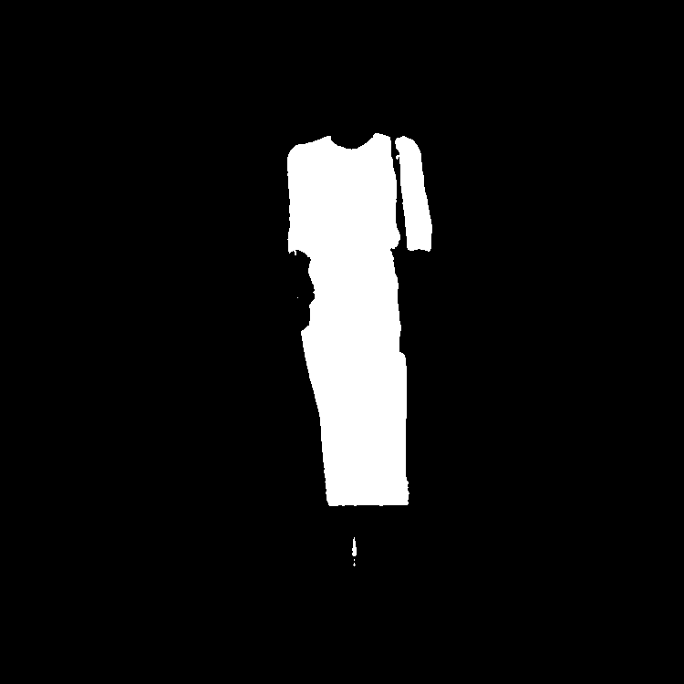
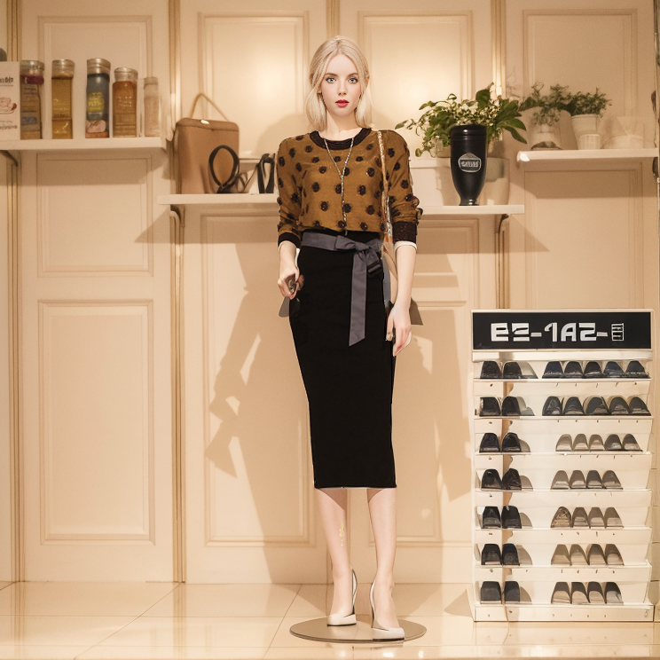
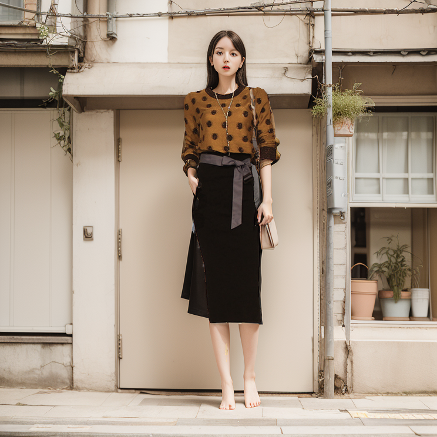
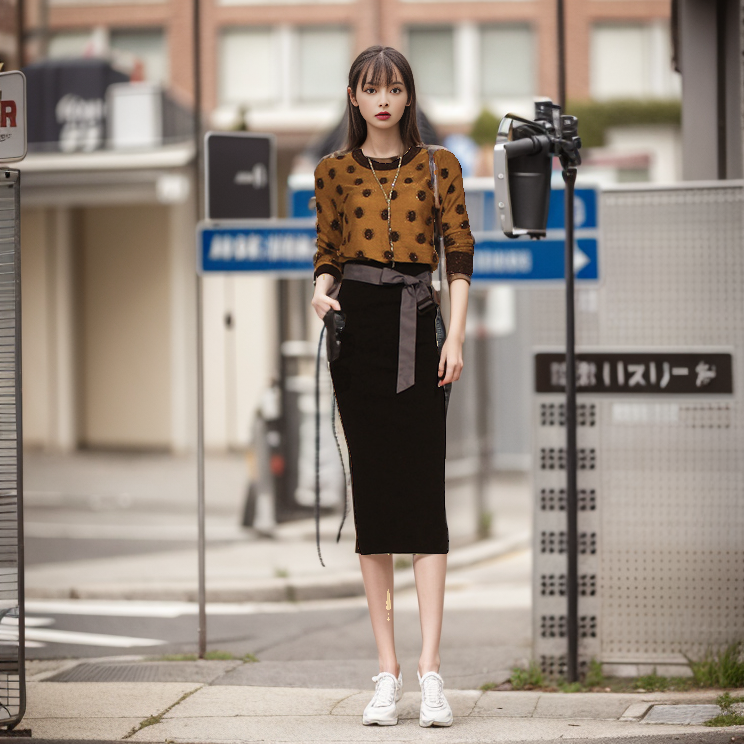

## weshop_pipeline

复现[weshop](https://www.weshop.com)人台模特换装生成的pipeline

结论： 基于sam+inpainting+lora可以复现weshop的pipeline

### weshop测试

weshop的数据要求： 绿幕人台模特

直接给一张带背景网图测试，首先基于SAM分割出所有物体，手动选择衣服的部分，获取mask，然后进行生成:

|          origin           |          weshop 1           | weshop 2                    |
|:-------------------------:|:---------------------------:|-----------------------------|
|  |  |  | 

得到几个信息：

- weshop只进行了衣服外部区域的重绘
- 重绘时使用了controlnet的edge类约束（测试发现是为了约束衣服的边缘不向外扩张）
- 人脸效果差，应该没有引入lora模型
- 除了生成模型外，没做其他后期处理

### 复现效果

Using [sd-webui-segment-anything](https://github.com/continue-revolution/sd-webui-segment-anything) to get cloths mask:

|          origin           |                mask                |
|:-------------------------:|:----------------------------------:|
|  |  | 

A bit poor result, may due to low resolution or webui plugin defects.

|          origin           |          inpainting 1           |          inpainting 2           |
|:-------------------------:|:-------------------------------:|:-------------------------------:|
|  |  |  | 

- different model like [sd1.5-inpaint](https://huggingface.co/runwayml/stable-diffusion-inpainting) or lora
- with/without controlnet

### 人脸换头

1. single face swap:

   - [InSwapper](https://github.com/deepinsight/insightface)
   - [ReliableSwap](https://github.com/ygtxr1997/ReliableSwap)
   - HifiFace private model

2. face inpainting like [miaoya_pipeline](https://github.com/ykk648/miaoya_pipeline)

|      after cloth inpainting       |            face swap            |         face inpainting         |
|:---------------------------------:|:-------------------------------:|:-------------------------------:|
|  |  |  | 

### Support

- lora model from [civitai](https://civitai.com/models)
- origin photo from Taobao

### TODO

- [ ] pipeline extract from sd-webui based on sd-api
